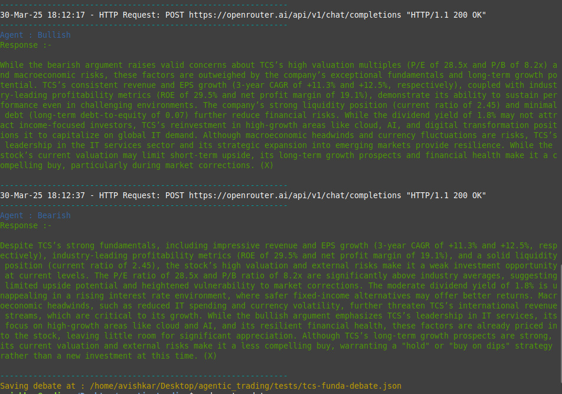

# Multi-agent Trading Framework


This tool simulates a trading firm, by assigning each role of the firm hierarchy to each agent(s)/ team. 

Research baseline : https://arxiv.org/pdf/2412.20138

## Research objectives
The research objectives cover :-
- Exploration of LLM based trading strategy on **Indian markets.**
- Exploration of **LLM capabilities** for stock trading.

## Test Results

Assuming the following :-
- Intial Investment INR 100000/-
- Share : TCS (Tata Consultancy Services)
- Test period start : 2025-01-01
- Test period end : 2025-04-01

Results :-

| Category   | Model              | Final Portfolio Val | CR%     | ARR%   | SR |
|------------|--------------------|---------------------|---------|--------|----|
| Market     | B&H                | 86,538.0400         | -13.46% |        |    |
| Rule Based | MACD               | 98169.50            | -1.83%  |        |    |
| Rule Based | SMA                |                     |         |        |    |
| Ours       | MultiAgent Trading | 111,705.7900        | 11.71%  | 55.89% |    |

## Usage

#### Set the folowing env variables in a .env file

```
# Necessary
GEMINI_API_KEY=""
SERP_KEY=""

# Optional
OPENROUTER_API_KEY=""

# For future
REDDIT_CLIENT_SECRET=""
REDDIT_CLIENT_ID=""
REDDIT_USER_AGENT=""
X_BEARER_TOKEN=""
```


#### Running the code
```python3 main.py```

#### Start viewer
```python -m viewer.viewer```


## Data Sources
- [Yahoo Finance](https://pypi.org/project/yfinance/) : Price & Technicals
- [Screener](https://www.screener.in) : Fundamental ratios
- [SerpAPI](https://serpapi.com/google-news-api) : News articles

## Methodology

### Debate Engine
#### Customized this [repo](https://github.com/composable-models/llm_multiagent_debate).
- This engine simulates the debate between bullish and bearish perspective with regards to a stock - something which takes place in a trading firm.
- Fixed two agents : Bullish & Bearish
- Set number of rounds of debate = n
- Each agent gets the previous response of the other agent - in order to prepare a counter argument based on their assigned roles i.e. giving reason why to buy/not buy the stock.

Simulation demo output :-



## Resources

- LLM Debate : https://arxiv.org/pdf/2305.14325
- MetaGPT : https://github.com/geekan/MetaGPT ([Paper](https://cnaiwiki.com/aiweb/file/EN_METAGPT.pdf))
- Llama 3.3 (free) : [via OpenRouter](https://openrouter.ai/meta-llama/llama-3.3-70b-instruct:free)
- Twitter Sentiment Dataset : [via Kaggle]()
- MACD Strategy : [Click](https://github.com/nmayur1997/MACD-Strategy/blob/main/MACD%20Strategy.py) 
- MD Table Generator : [Click](https://www.tablesgenerator.com/markdown_tables)
